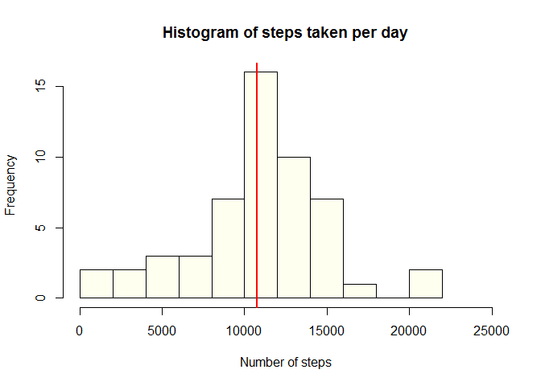
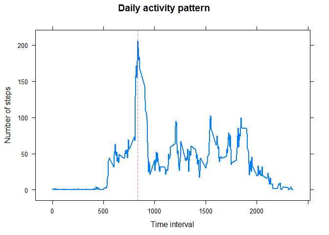
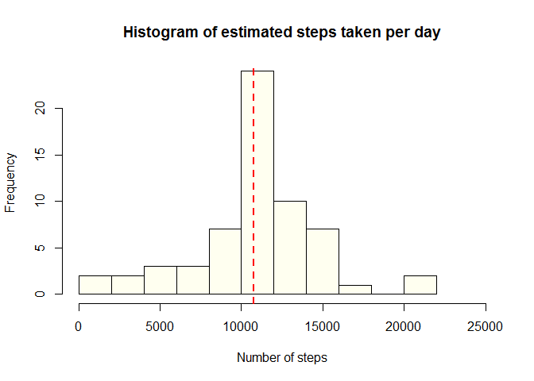
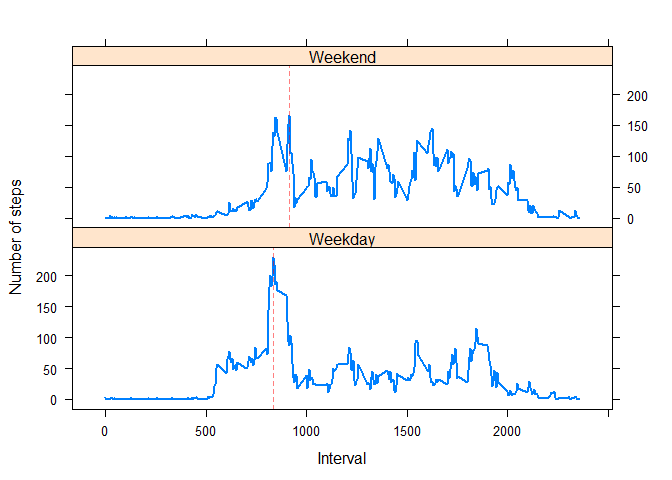

# Reproducible Research: Peer Assessment 1


## Loading and preprocessing the data

The file *activity.zip* must be in the current directory

1. The file is read with read.csv(); unz() is used to unzip the file
2. A datetime string is calculated with sprintf(); the %04d means four digit time (with leading zeroes if necessary)
3. The datetime string is coerced to POSIXct
3. The dates are coerced from Factor to Date with as.Date()
4. DFValid dataframe is a subset of the original dataframe excluding the missing values for steps
  
  

```r
    DF <- read.csv(unz("activity.zip", "activity.csv")) 
    DF$datetime <- sprintf("%s %04d", DF$date, as.integer(DF$interval))
    DF$datetime <- as.POSIXct(DF$datetime, format = "%Y-%m-%d %H%M")
    DF$date <- as.Date(DF$date, format = "%Y-%m-%d")   
    DFValid <- DF[!is.na(DF$steps), ]
```


## What is mean total number of steps taken per day?

To get the total number of steps taken per day:  

1. Using tapply(), apply the function sum() to the column "steps" for each "date"
2. Plot the histogram with hist()
3. Draw a vertical line indicating the mean of the distribution
  
  

```r
    TotSteps <- tapply(DFValid$steps, DFValid$date, sum)    
    hist(TotSteps, col = "ivory", breaks = 15, xlim = c(0, 25000),
         main ="Histogram of steps taken per day",
         xlab ="Number of steps")    
    abline(v = mean(TotSteps), col = "red", lwd = 2)
```

 

**Observations:**

- On average, 10,766.189 steps are taken per day (vertical red line)
- The median is equal to 10,765.000 steps taken per day (very close to the mean)


## What is the average daily activity pattern?
To compute the average daily activity pattern:  

1. DF2 is a new data frame to be passed to xyplot lattice function
2. The AvgSteps is computed by applying with tapply() the function mean() to the field "steps" for each "interval"
3. The Interval is computed from the names of the rows of DF2
4. The interval with the maximum average of steps is stored in xMax
4. When invoking xyplot, the panel function invokes the default and then draws a vertical line on xMax
  
  

```r
    library(lattice)
    DF2 <- data.frame(AvgSteps = tapply(DFValid$steps, DFValid$interval, mean))
    DF2$Interval <- as.numeric(names(DF2[, ]))
    xMax = DF2$Interval[which(DF2$AvgSteps == max(DF2$AvgSteps))]
               
    xyplot(AvgSteps ~ Interval, data = DF2, type = "l", lwd = 2,
           main = "Daily activity pattern",
           ylab = "Number of steps",
           xlab = "Time interval",
           panel = function(x, y, ...) {
               panel.xyplot(x, y, ...)
               panel.abline(v = xMax, col = rgb(1, 0, 0, 0.5), lty = 2)
           })
```

 

**Observations:**

- The peak at 0835 (red dashed line) indicates the interval of maximum activity on an average day


## Imputing missing values
To estimate values for the missing values:  

1. A new data frame DF3 is created from the original data frame
2. Determine which are the indices of DF3 with missing steps
3. Assing to the missing steps the average steps for that interval  stored in DF2
4. Compute the total number of steps for each date with tapply()
5. Plot the histogram
6. Plot a vertical line to show the location of the mean
  
  

```r
    DF3 <- DF
    missing = which(is.na(DF3$steps))
    DF3$steps[missing] <- DF2[as.character(DF3$interval[missing]), 1]    
    TotSteps3 <- tapply(DF3$steps, DF3$date, sum)    
    hist(TotSteps3, col = "ivory", breaks = 15, xlim = c(0, 25000),
         main ="Histogram of estimated steps taken per day",
         xlab ="Number of steps")    
    abline(v = mean(TotSteps3), col = "red", lwd = 2, lty = "dashed")
```

 
  
  
**Observations:**

- On average, 10,766.189 steps are taken per day (vertical red line)  
- The median is equal to 10,766.189 steps taken per day (very close to the mean)  
  
  
Compared to the data without estimating missing values:

- 2304 values where estimated
- The total number of steps is much bigger (656,738
 now vs. 570,608 before)
- The median remains almost equal
- The average is exactly the same (the difference of means is equal to 0)


## Are there differences in activity patterns between weekdays and weekends?

In order to plot the differences in activity patterns:

1. Since weekdays(DF$datetime[1]) produces "lunes" if you are in Spain and "Monday" if you are in the USA
2. We divide the date by 7 and get the module, which value for Saturdays is alwasy 2 no matter the location
3. Then we compute a logical vector with the dates that are weekends
4. For weekdays and weekends, the DF4 is obtained by tapply() the mean() function to the two subsets of "steps"
5. The result is plotted with vertical lines for the maximum
  
  

```r
    # weekdays() retrieves a location dependent string "sáb" and "dom" (Spain) vs "Sat" and "Sun" (USA)
    DF3$Weekday <- weekdays(DF3$datetime) 

    # so a more robust option is to divide by 7 and get the module (equals to 2 for Saturday or 3 for Sunday)
    DF3$Weekday <- as.integer(DF3$date) %% 7 
    IsWeekend <- (DF3$Weekday == 2 | DF3$Weekday == 3)

    # first process weekdays
    AvgSteps <- tapply(DF3$steps[!IsWeekend], DF3$interval[!IsWeekend], mean)
    DF4 <- data.frame(Interval = as.integer(names(AvgSteps)), Type = "Weekday", AvgSteps = AvgSteps)

    # then process weekends
    AvgSteps <- tapply(DF3$steps[IsWeekend], DF3$interval[IsWeekend], mean)
    DF4 <- rbind(DF4, 
                 data.frame(Interval = as.integer(names(AvgSteps)), Type = "Weekend", AvgSteps = AvgSteps))

    # finally plot the result    
    xyplot(AvgSteps ~ Interval | Type, data = DF4, type= "l", lwd = 2, layout= c(1,2),
           ylab = "Number of steps",
            panel = function(x, y, ...) {
               panel.xyplot(x, y, ...)
               panel.abline(v = x[which(y == max(y))], col = rgb(1, 0, 0, 0.5), lty = 2)               
                })
```

 
  
  
**Observations:**

- The interval with maximum activity is different in weekends and weekdays 

